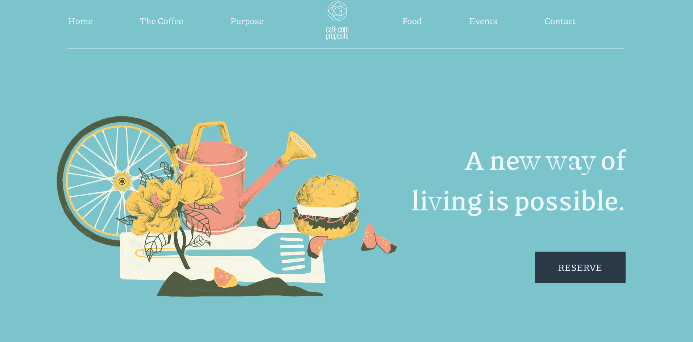

# Website-Landing-Pages
Random website designs through which I practised html, css and vanilla js.

<>

## Color Palette : 
 

 

## Profile card: 

 

 

## Environment: 

 

 

## Cafe: 

 

 

## PeaceTreks: 

 

 

## Kerala: 

 

 